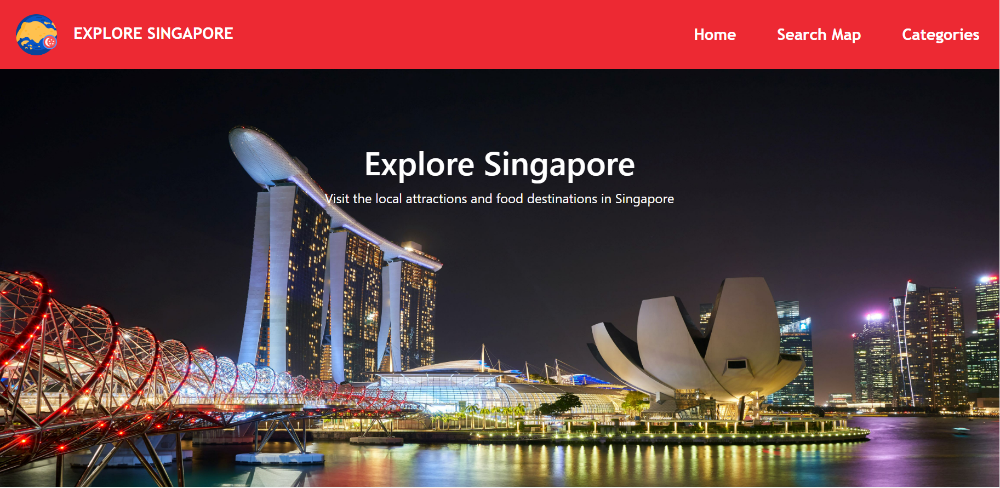

#Explore Singapore

<h2> Project Summary</h2>
Explore Singapore is an interactive map which allows the users to find the tourist and food destinations they could easily visit in Singapore.
<h3>Target Audience:</h3>
.Family members planning a vacation trip.
.Individuals or friends planning a getaway trip.
.Working professionals on business travels.
<h3>Characteristics:</h3>
.Demographics:15 yrs. old to 65 yrs. old
.Individuals who values travelling and enjoys the experiences in the places they visit.
<h3>User Goals:</h3>
.To search for all the nearby tourist attractions and food destinations when they visit.
.This could help the users to easily plan their itineraries.
<h3>Organizational Goals:</h3>
.The website aims to aide the users to search and locate the tourist spots and nearby food destinations when they visit the location.
<h3>Justification:</h3>
.The website app helps the users to easily find the tourist spots and food destinations in the area which they could use as they plan their trip.
<h2>UX/UI</h2>

|                 User Stories                 |                Acceptance Criteria                 |
| -------------------------------------------- | ---------------------------------------------------|
| As a user I want to know the location of the | Providing the locations would the help the users   |
| tourist spots and nearby restaurants so that | to find the nearest tourist spots and restaurants. |
| I can easily plan our next trip.             |                                                    |

<h3>Five Planes of UI/UX</h3>
<h4>Strategy:</h4>
.User: People who wants to travel and visit the tourist spots
.User Needs: To easily locate the tourist spots and nearby restaurants in the area.

<h4>Scope:</h4>

Functional requirements:
.Search for restaurant locations
.Search for tourist spots

Content requirements:
.Name of the location
.Opening hours
.Location address
.Short description of the place

<h4>Structure:</h4>

.Users can find the location of the places they wish to find using the search bar or the widget on the side of the map.

<h4>Skeleton:</h4>
https://wireframe.cc/lC3tQv
https://wireframe.cc/UKDtD4
https://wireframe.cc/jh9DUo

<h4>Surface:</h4>
.The website uses three colors namely red, white and black. The black and white colors are mainly used for important details while the vibrant color of red is used in the markers of the map. The app uses the font Trebuchet MS for all the details in the website as it looks clean and modern.

<h3>Features</h3>
.The main features of the website are the search bar and widget in the map where you can use to find the location of the tourist spots and restaurants in the area.
.Limitattions - Some details in the markers was different from the other markers due to the different API sources.

<h3>Technologies Used</h3>
.Bootstrap 5.1 - Used to create the navbar, results and buttons.
.HTML - Used to display the details in the web browser.
.CSS - To style the components of the website
.Javascript - To create interactive web applications
.Foursquare - Used the API data for the map
.Leaflet - To create the map
.Leaflet Cluster - Used to create cluster of markers in the map
.Axios - HTTP client for the browser
.Mapbox - Used for tile layers on the map
.FontAwesome - Used icons for the search button and navbar

<h3>Testing</h3>
1. Test the user can use Search Map in Navbar
  a. From the navbar, click on the Search Map button.
  b. The user should be redirected to the map.
2. Test user on using the search bar
  a. Type any food or place in the search bar
  b. Markers will show up corresponding on the details typed in the search bar
  c. Click on one of the markers and it will zoom in on the place and it will show the details like name and address.
3. Test user on using the widget
  a. Click on the widget on the map and it will show all the tourist spots in Singapore.
  b. Click on one of the markers and it will show the name, opening hours and the place description.
 <h3>Deployment</h3>
 The website is hosted in Github and the instructions on deployment is in the attached link:
 https://docs.github.com/en/pages/getting-started-with-github-pages/creating-a-github-pages-site
 
<h3>Credits and Acknowledgement</h3>
Data - Data.gov.sg and Foursquare API
Markers and Icons - flaticon.com
Photos - Pexels
Consultations:
I would like to express my gratitude to all the teachers who guided and provided advice in completing the project.

